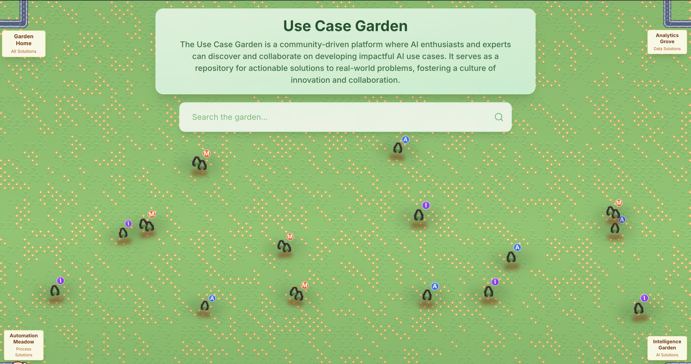

# Use Case Garden



## Overview

The Use Case Garden is a community-driven platform where AI enthusiasts and experts can discover and collaborate on developing impactful AI use cases. It serves as a repository for actionable solutions to real-world problems, fostering a culture of innovation and collaboration.

## Features

- **Modern UI**: Built with Next.js and React.
- **Responsive Design**: Adapts to different screen sizes.
- **Interactive Components**: Utilizes various UI components for a dynamic user interface.

## Getting Started

### Prerequisites

- Node.js (v14 or later)
- pnpm

### Installation

1. Clone the repository:
   ```bash
   git clone <repository-url>
   cd <project-directory>
   ```

2. Install dependencies:
   ```bash
   pnpm install
   ```

3. Run the development server:
   ```bash
   pnpm run dev
   ```

4. Open [http://localhost:3000](http://localhost:3000) in your browser to see the application.

## Contributing

Contributions are welcome! Please feel free to submit a Pull Request.

## License

This project is licensed under the MIT License - see the LICENSE file for details. 